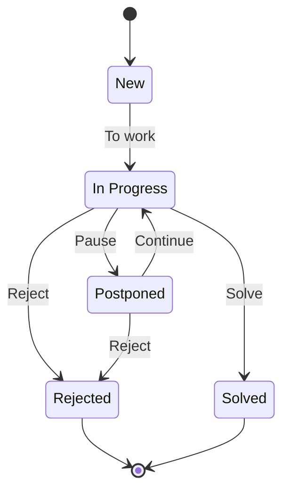
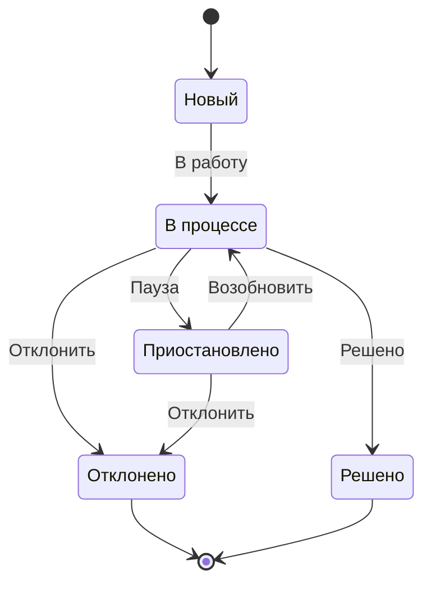

# MVP

[toc]

## Инфраструктура

- [ ] Bben or Simplecloud or i7-450
- [ ] CentOS 8
- [ ] nginx
- [ ] Gitea or Gitlab
- [ ] DroneCI or Gitlab CI
- [ ] Project Life
- [ ] Celery
- [ ] gunicorn
- [ ] Docker

## Модули

### Core

- [ ] Возможность отправки уведомлениий при наступлении события
- [ ] Различные каналы уведомлений (Telegram, E-mail, Slack и т.д.)

### Задачи

- [x] Разбивка на проекты
- [ ] Добавление описания и комментариев к задачам
- [ ] Статусы задачи

### Дневник

- [ ] Пост с указанием даты за какой день идет речь
- [ ] Формат: Markdown, BBCode, reStructuredText
- [ ] Даты написания и редактирования должны генерироваться автоматически
- [ ] Дата поста должна быть уникальной
- [ ] Оценка дня по 10-бальной шкале

### Оборудование и ПО

- [ ] Указание наименования
- [ ] Справочник типов оборудования
- [ ] Возможность указать дату приобритения и срок гарантии (лицензии для ПО) в днях
- [ ] Срок окончания должен рассчитываться

### Бухгалтерия

- [ ] Список счетов (в том числе наличных)
- [ ] Указание текущего баланса на текущее время
- [ ] Вывод суммарного баланса на текущее время с разбиением
- [ ] Построение графика изменения суммарного баланса или баланса по счету

### Люди

### Комиксы

- [ ] Сортировка по номеру страницы
- [ ] Номер страницы должен быть уникальным значением
- [ ] Указание языка
