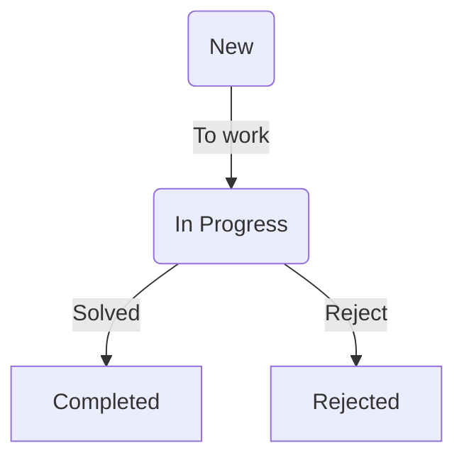

# MVP

[toc]

## Инфраструктура

* Bben

## Модули

### Задачи

- Разбивка на проекты
- Статусы задачи

### Дневник

* Пост с указанием даты за какой день идет речь
* Формат: Markdown, BBCode, reStructuredText
* Даты написания и редактирования должны генерироваться автоматически
* Дату написания должна быть уникальной

### Бухгалтерия

### Люди

### Комиксы
